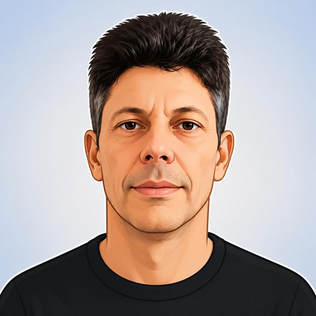

  

<h2 align="center">Olá, eu sou o Robson! 👋</h2>

---

## Sobre mim
Sou uma pessoa em transição para a programação, com interesse especial em Inteligência Artificial...

---

### Sobre mim

Sou uma pessoa em transição para a programação, com interesse especial em Inteligência Artificial, automação e soluções práticas.

### Em aprendizado

- Python
- Git e GitHub
- HTML, CSS e JavaScript
- Fundamentos de IA e Machine Learning

### Projetos

- Em desenvolvimento

### Objetivos

- Construir projetos práticos
- Consolidar bases em programação
- Aprofundar conhecimentos em IA
- Criar um portfólio técnico consistente

### Contato

- GitHub: [em desenvolvimento]
- LinkedIn: [seu link]

